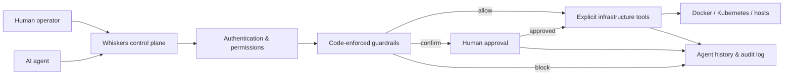
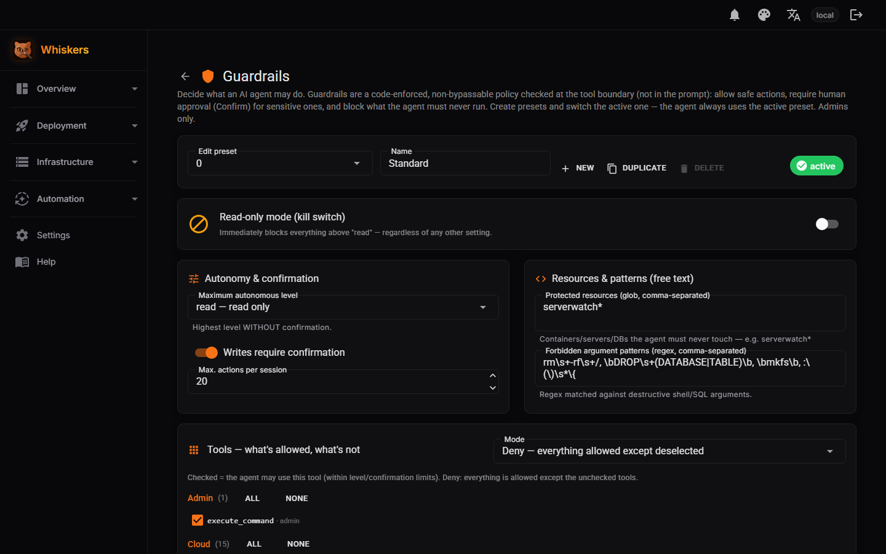
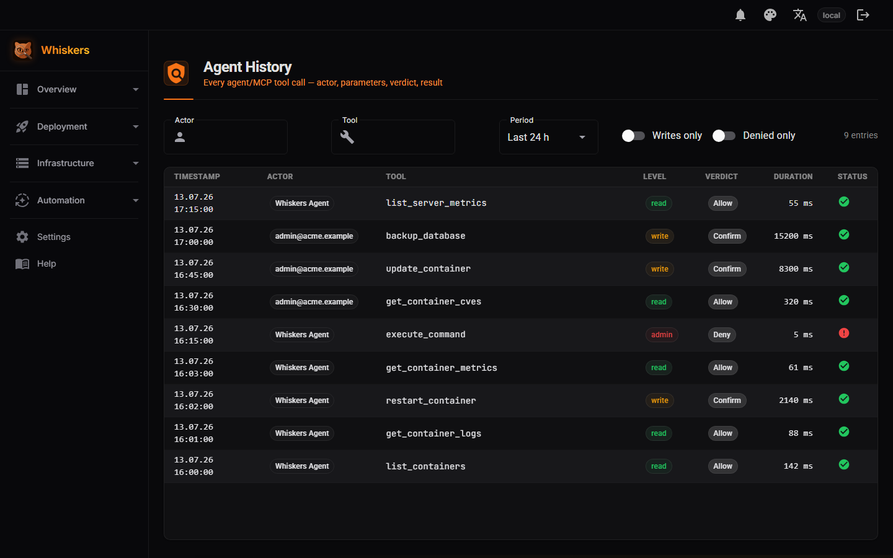
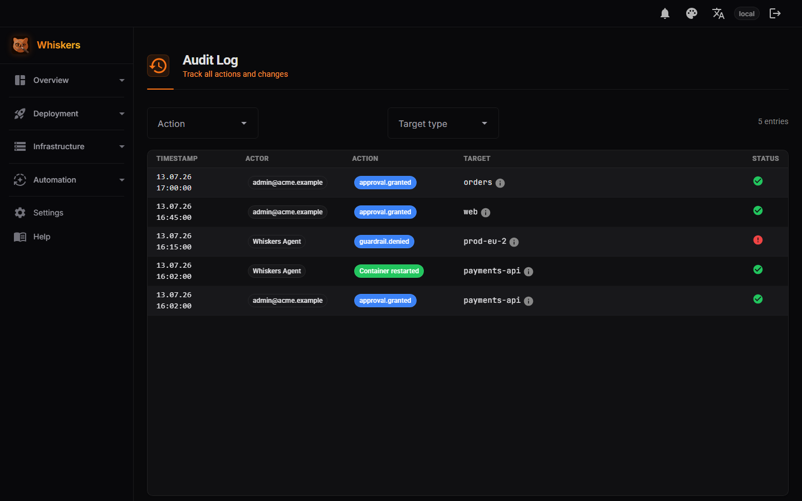
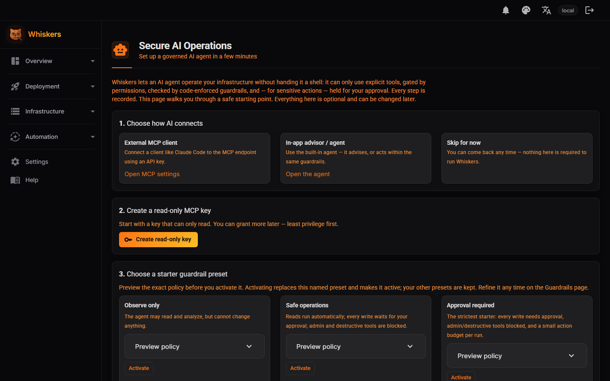
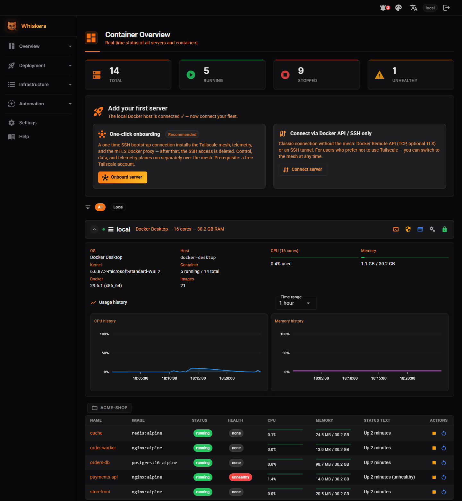

<p align="center">
  
</p>

<h1 align="center">Whiskers</h1>

<p align="center"><strong>Controlled infrastructure operations for humans and AI agents.</strong></p>

<p align="center">
Whiskers is a <strong>self-hosted control plane</strong> for Docker hosts and Kubernetes workloads.
Instead of handing operators or AI agents unrestricted SSH access, it exposes explicit tools
governed by <strong>permissions, code-enforced guardrails, approvals and a complete action history</strong>.
</p>

<p align="center"><em>Bootstrap a host once, then operate over mesh + mTLS without a standing private SSH key.</em></p>

<p align="center">
<a href="https://github.com/LupusMalusDeviant/Whiskers/releases"></a>
<a href="#roadmap--beta"></a>
<a href="LICENSE"></a>
<a href="https://dotnet.microsoft.com/"></a>
<a href="https://learn.microsoft.com/aspnet/core/blazor/"></a>
</p>

> ⚠️ **Beta.** Whiskers is under active development and not yet API-stable.
> Run it on a trusted network, review the [security policy](SECURITY.md), and expect breaking
> changes before `1.0`.

---

## Why Whiskers

AI agents can operate infrastructure — but the usual way to let them is to hand over an SSH key or a
shell, which grants far more power than any single task needs. Whiskers puts a governed layer in
between:

- **Limit what an operator or agent can do.** API keys, roles and explicit tool access define the
  available capability set — no arbitrary shell.
- **Require approval before impact.** Code-enforced guardrails allow, block, or pause sensitive
  operations for human confirmation.
- **Know exactly what happened.** Agent History and the Audit Log record actor, decision, target,
  parameters (secrets redacted) and result.

The same control plane reaches Docker, Kubernetes, logs, deployments, services and CVE context — but
that reach is evidence of coverage, not the headline. The headline is **governed, accountable
operations**. See [docs/product/POSITIONING.md](docs/product/POSITIONING.md) for the full positioning.

### How governance works



---

## Table of contents

- [Quick start](#quick-start)
- [The hero workflow](#the-hero-workflow)
- [Capabilities](#capabilities)
- [Architecture & security](#architecture--security)
- [MCP server](#mcp-server)
- [AI agent](#ai-agent-optional)
- [Configuration](#configuration)
- [Screenshots](#screenshots)
- [Roadmap & beta](#roadmap--beta)
- [Project structure](#project-structure)
- [Development](#development)
- [Contributing](#contributing)
- [License](#license)

---

## Quick start

> Prebuilt multi-arch images (amd64 / arm64) are published to **`ghcr.io/lupusmalusdeviant/whiskers`** from **v0.12.0**. Before that release, use the *From source* path below.

### Quick — one command

```bash
# Installer: pulls the image, writes a small compose file in ./whiskers/, waits until healthy, prints the URL.
curl -fsSL https://raw.githubusercontent.com/LupusMalusDeviant/Whiskers/main/deploy/install.sh | bash

# ...or a bare docker run:
docker run -d --name whiskers -p 127.0.0.1:5100:8080 \
  -v whiskers-data:/app/data -v /var/run/docker.sock:/var/run/docker.sock \
  ghcr.io/lupusmalusdeviant/whiskers:latest
```

Open `http://127.0.0.1:5100`. The installer accepts `--port`, `--bind`, `--data`, `--yes` (`install.sh --help`); re-running it updates in place (`pull` + `up`).

### Standard — Docker Compose

Download `docker-compose.yml` from the [latest release](https://github.com/LupusMalusDeviant/Whiskers/releases) (already pinned to the image), then `docker compose up -d`. Optional settings go in a `.env` beside it — **everything is optional**, Whiskers runs with none (see [.env.example](.env.example)).

The app listens on `127.0.0.1:5100` by default (`HOST_BIND` / `HOST_PORT`) and never binds publicly unless you change the bind.

### First sign-in

On first launch a **guided setup wizard** in the browser creates the admin account — no `.env` and no config file required. From then on you sign in with that **local login** (email + password). Alternatives: seed the admin unattended with `WHISKERS_ADMIN_EMAIL` + `WHISKERS_ADMIN_PASSWORD_FILE`; use **Google** or **generic OIDC** (see [Configuration](#configuration)); or, for a localhost-only trial, `AUTH_DISABLED=true` (never on a public bind).

### More install options

<details>
<summary>Behind an Nginx reverse proxy</summary>

```nginx
location /serverwatch/ {
    proxy_pass http://127.0.0.1:5100/serverwatch/;
    proxy_http_version 1.1;
    proxy_set_header Upgrade $http_upgrade;
    proxy_set_header Connection $connection_upgrade;
    proxy_set_header Host $host;
    proxy_set_header X-Real-IP $remote_addr;
    proxy_set_header X-Forwarded-For $proxy_add_x_forwarded_for;
    proxy_set_header X-Forwarded-Proto $scheme;
    proxy_set_header X-Forwarded-Prefix /serverwatch;
    proxy_read_timeout 300s;
    proxy_buffer_size 128k;
    proxy_buffers 4 256k;
}
```

When serving under a subpath, set `PATH_BASE=/serverwatch` in `.env`.
</details>

<details>
<summary>Deployment profiles (full vs. hardened)</summary>

- **Full** (`docker-compose.yml`, default): privileged + host PID namespace so Whiskers can manage
  its **own** host (firewall/Nginx/systemd/`execute_command` via `nsenter`) and run an in-container VPN.
- **Hardened** (`docker-compose.hardened.yml`): for monitoring **remote** hosts only — non-root, no
  `privileged`, dropped capabilities, read-only rootfs, and Docker access through a verb-restricted
  socket-proxy. Trades away local host-shell management for a much smaller attack surface.

See **[docs/container-hardening.md](docs/container-hardening.md)** for the full matrix and trade-offs.
</details>

<details>
<summary>Kubernetes (Helm)</summary>

Run Whiskers **on** a cluster as the control plane for your remote Docker fleet (and Kubernetes
clusters — pods appear next to containers on the dashboard):

```bash
helm install whiskers oci://ghcr.io/lupusmalusdeviant/charts/whiskers \
  --set vault.key="$(openssl rand -hex 32)"
kubectl port-forward svc/whiskers 8080:8080   # → http://localhost:8080 (setup wizard)
```

Single-replica by design (Blazor Server + stateful loops), non-root, read-only rootfs, PVC-backed
data. All values, ingress/WebSocket notes and the Postgres variant:
**[deploy/helm/whiskers/README.md](deploy/helm/whiskers/README.md)**. To *manage* a cluster from
Whiskers instead, see **[deploy/k8s/README.md](deploy/k8s/README.md)**.
</details>

<details>
<summary>From source (development)</summary>

```bash
git clone https://github.com/LupusMalusDeviant/Whiskers.git
cd Whiskers
docker compose up -d          # builds the image locally
```

Copy [.env.example](.env.example) to `.env` to override any defaults. `.env` is gitignored — secrets never land in the repository.
</details>

---

## The hero workflow

The flow that defines the product — **Observe → Propose → Check policy → Request approval → Execute → Verify → Audit**:

1. A container / workload is **unhealthy**.
2. An agent analyses status and logs using a **read**-scoped key — no write access needed.
3. The agent **proposes a restart**.
4. The active guardrail rates the restart tool as **Confirm**, so nothing runs yet.
5. Whiskers raises an **approval request**: actor, tool, target server, target workload, redacted
   parameters, rationale and expiry.
6. A human **approves** it.
7. Whiskers executes **only** the approved action, with the approved parameters.
8. Whiskers **verifies** the workload afterwards.
9. **Agent History** and the **Audit Log** show the full chain, and the UI deep-links between
   result, approval and history.

This is the reference workflow for AI-operations onboarding and the acceptance test for governance.

---

## Capabilities

Docker, Kubernetes and the rest are **targets** the control plane governs — grouped by what they do
for you:

### Governance

- **Per-key permissions** — MCP API keys are scoped Read / Write / Admin, or to an explicit tool list.
- **Code-enforced guardrails** — per-tool **Allow / Confirm / Block**, evaluated at the tool boundary (not in the prompt), "most-restrictive wins".
- **Human-in-the-loop approvals** — a `Confirm` tool pauses execution until an authorized user approves the exact action + parameters.
- **Agent History** — every agent tool call recorded: actor/key, redacted parameters, decision, result, duration, target.
- **Audit Log** — every user action recorded, with a filterable history.

### Operations

- **Containers** — live dashboard (CPU / memory / health) across all hosts; start / stop / restart / remove; logs, stats, health reports; grouping by server, Compose project and free-form **tags**.
- **Kubernetes** — add a k3s/Kubernetes cluster via kubeconfig (stored encrypted in the vault); pods appear next to containers with owner grouping, logs and honest scale/rollout actions.
- **Host management** — firewall (ufw), Nginx sites, systemd services, SSL certificates and an integrated web terminal (host and container).
- **Deployments** — a deploy form, Compose upload, curated app templates, image search across registries, and **git deploy** (repo → cloned/built/composed on the target host; push-triggered redeploys via HMAC-signed webhooks).

### Security

- **CVE scanning** — OS and container images (Trivy) with a deduplicated findings dashboard, severity and age.
- **Secrets vault** — stored secrets encrypted at rest (AES-256-GCM); sensitive values redacted before logging and persistence.
- **Mandatory HMAC webhook secrets** (`X-Hub-Signature-256`-compatible) and **fail-closed authorization** — every endpoint requires authentication unless it explicitly opts out.
- **SSH host-key verification** (trust-on-first-use) on every ssh path.
- **Mesh + mTLS** steady-state operation (see [Architecture & security](#architecture--security)).

### Resilience

- **Self-backup & restore** of Whiskers' own data — optionally VAULT_KEY-encrypted (AES-256-GCM), schedulable, crash-safe deferred-swap restore.
- **Image-update rollback** — a snapshot before each update; one-click revert on the dashboard.
- **Monitoring & alerting** — historical CPU/RAM/disk metrics, health reports, and notifications (Mattermost, Matrix, Telegram, ntfy, Discord, Slack, Email/SMTP, generic webhook) on unhealthy/stopped/OOM containers, restart loops, sustained-load anomalies, new CVEs and available image updates, with a persistent in-app feed.

### Integrations

- **MCP server** — the authenticated interface for external AI clients (see [MCP server](#mcp-server)).
- **Cloud control (out-of-band)** — provider-agnostic power / snapshot / metrics (Hetzner, Hostinger) via the provider API, even when SSH/Docker is temporarily unreachable.
- **Registries** — private-registry credentials in the vault, used automatically for authenticated pulls.
- **Database** — SQLite (zero-config) or PostgreSQL via Entity Framework Core.
- **UI** — light / dark / system theme and a fully localized **English (default) / German** interface.

---

## Architecture & security

Whiskers manages hosts across three independent planes, each moved off SSH at steady state:

| Plane | What | Transport |
|---|---|---|
| **Telemetry** | host CPU/RAM/disk, container stats | `node_exporter` → VictoriaMetrics (pull over the mesh) |
| **Docker control** | list/restart/deploy/inspect | Docker Engine API over **mTLS** + verb-whitelisting proxy |
| **Shell** | `execute_command`, systemd, journald, edits | one-shot privileged `nsenter` container over the same mTLS channel |

A **one-time bootstrap SSH** connection during onboarding moves a host onto a private WireGuard mesh
(Tailscale/NetBird), installs telemetry + the mTLS Docker proxy, then removes the bootstrap
credentials. After that, **steady-state operation runs without a standing private SSH key** — the
central attack surface is gone. The full design, PKI (step-ca), onboarding flow and trade-offs are in
**[docs/ARCHITECTURE.md](docs/ARCHITECTURE.md)**.

### Security summary

- **No standing SSH key** for managed hosts in steady state; management ports are **mesh-bound**, nothing management-related is exposed to the public internet by design.
- **MCP access is gated per API key** (Read / Write / Admin); the acting agent is bounded by **code-enforced guardrails** and can never exceed the rights of whoever/whatever triggered it.
- **Secrets** (`.env`, the encrypted vault, the DB) live under `/app/data` / `.env`, both gitignored and volume-mounted — never baked into the image or committed.
- **Full-repo security review & remediation** (see the [security-fixes changelog](docs/reviews/2026-07-07-security-fixes-changelog.md)): all critical and high findings, plus most medium/low issues, are fixed — per-key RBAC on **every** path (including the agent and MCP), the vault on **AES-256-GCM + PBKDF2**, schema via **EF Core migrations**, trust-critical images **pinned by digest**, restricted forwarded-header trust, and a scrape-token-gated `/metrics`.

### Supply chain

Every published release image is, from **v0.12.1** on:

- **scanned before it ships** — the release pipeline builds the image, runs a Trivy scan, and **fails the whole run on any CRITICAL** so a vulnerable image is never pushed;
- **built multi-arch with provenance + an SBOM attestation** (SLSA provenance and an SPDX SBOM attached to the image, and a standalone SBOM as a release asset);
- **keyless-signed with [cosign](https://github.com/sigstore/cosign)** (Sigstore) — the signature is bound to the release workflow's GitHub OIDC identity and recorded in the public Rekor transparency log; no signing key is held by anyone.

Verify the signature before you run it:

```bash
cosign verify ghcr.io/lupusmalusdeviant/whiskers:0.13.0 \
  --certificate-identity-regexp '^https://github.com/LupusMalusDeviant/Whiskers/.github/workflows/release.yml@refs/tags/v' \
  --certificate-oidc-issuer https://token.actions.githubusercontent.com
```

A valid result means the image was built by this repository's release workflow from a tag — not rebuilt or tampered with. (Images published before v0.12.1 are provenance-attested but not cosign-signed.)

If you discover a security issue, please report it privately — see [SECURITY.md](SECURITY.md).

---

## MCP server

Whiskers ships an integrated MCP server so AI agents (e.g. Claude Code) can operate your infrastructure. Add it to your MCP client:

```json
{
  "mcpServers": {
    "serverwatch": {
      "url": "https://your-server.com/serverwatch/mcp",
      "headers": { "Authorization": "Bearer <API-KEY>" }
    }
  }
}
```

**Permissions are enforced per API key** as Read / Write / Admin. Tools span:

- **Containers**: list/inspect/logs/metrics/env, start/stop/restart/update
- **Server & host**: info, logs, metrics, health summary, `execute_command` (Admin)
- **Deployment**: `deploy_app`, `deploy_compose`
- **Infrastructure**: firewall, Nginx, systemd, SSL
- **Databases**: detect, list, schema, query, backup
- **Networks**: list/create/remove, connect/disconnect containers
- **Logs & alerts**: search, list/create log alerts
- **Scheduler**: list/create/delete/run scheduled tasks
- **CVEs & updates**: server/container CVE summaries, update status
- **Cloud (out-of-band)**: Hetzner & Hostinger power/snapshot/metrics
- **Agent**: `instruct_agent` (delegate a natural-language task to the in-process agent)

The complete, current list with permission levels is in the web UI under *Settings > MCP*.

---

## AI agent (optional)

Beyond the MCP server (which serves *external* agents), Whiskers has an **in-process acting agent**: you describe an operations task in natural language and it plans and executes using Whiskers's own tools. It supports multiple LLM providers (OpenAI, OpenRouter, Ollama, Gemini, Anthropic, and Claude Code) selectable in the UI. An optional **read-only advisor chat** is also available — it explains and suggests but runs nothing.

Its safety model is enforced in code, not in the prompt:

- **Guardrails** (a separate, admin-only `guardrails.json`) define inescapable Allow/Confirm/Deny rules evaluated at the tool boundary, "most-restrictive wins".
- The agent **inherits the rights of whoever triggered it** (web user or MCP key) and can never exceed them.
- **Hybrid autonomy**: reads run autonomously; writes/admin actions require confirmation.

See [src/Whiskers/Services/Agent/](src/Whiskers/Services/Agent/) for the implementation.

---

## Configuration

Whiskers is configured entirely through environment variables (`.env`); **everything is optional**. The most important groups:

| Group | Keys | Notes |
|---|---|---|
| Authentication | `GOOGLE_CLIENT_ID`, `GOOGLE_CLIENT_SECRET`, `GOOGLE_ADMIN_EMAIL`, `AUTH_DISABLED` | Set `AUTH_DISABLED=true` for trusted LAN-only deployments where Google rejects private redirect URIs |
| Admin bootstrap | `WHISKERS_ADMIN_EMAIL` | Seeded as an **Admin** on first run (provider-neutral; `GOOGLE_ADMIN_EMAIL` does the same for Google) so a fresh instance is never admin-less. Also flips the email whitelist **fail-closed** once any role exists. Existing installs (with a `roles.json`) are untouched. |
| Local login | `WHISKERS_ADMIN_PASSWORD_FILE`, `Auth__LocalLogin__Enabled` | Username/password login without an IdP (ASP.NET Identity, its own tables in the same DB). On by default; set `Auth__LocalLogin__Enabled=false` for federated-only. Password policy: min 12 chars. |
| Secrets vault | `VAULT_KEY` | Passphrase that encrypts stored secrets at rest (AES-256-GCM). Empty = vault disabled. Keep it stable — losing it makes stored secrets undecryptable |
| OIDC (optional) | `OIDC_ENABLED`, `OIDC_AUTHORITY`, `OIDC_CLIENT_ID`, `OIDC_CLIENT_SECRET`, ... | Generic OpenID Connect (Authentik, Keycloak, Authelia, Zitadel, ...) for real 2FA/passkeys from your IdP |
| Notifications | `MATTERMOST_WEBHOOK_URL`, `MATTERMOST_ENABLED` | Matrix is configured in the UI |
| Routing | `PATH_BASE` | Path prefix when reverse-proxied under a subpath |
| AI chat | `AICHAT_ENABLED`, `AICHAT_API_KEY`, `AICHAT_API_URL`, `AICHAT_MODEL`, `AICHAT_PROVIDER` | Read-only advisor chat |
| Agent | `AGENT_ENABLED`, `AGENT_PROVIDER`, `AGENT_MODEL`, `AGENT_API_KEY`, ... | Acting agent (see above) |
| Mesh VPN | `VPN_PROVIDER`, `TAILSCALE_AUTHKEY`, `NETBIRD_SETUP_KEY`, ... | Pluggable VPN bring-up (`none`/`tailscale`/`netbird`); empty = legacy in-container Tailscale |
| Image search | `HARBOR_URL`, `HARBOR_USERNAME`, `HARBOR_PASSWORD` | Add a self-hosted Harbor marketplace (Docker Hub + GHCR are on by default) |
| Host binding | `HOST_BIND`, `HOST_PORT` | The container always listens on `8080` internally |
| Data directory | `WHISKERS_DATA_DIR` | Root for SQLite, JSON stores, keys & certificates (default `/app/data`); repoint at any volume / host path |
| Database | `WHISKERS_DB_PROVIDER`, `WHISKERS_DB_CONNECTION`, `WHISKERS_DB_CONNECTION_FILE` | `sqlite` (default, zero-config) or `postgres`. For Postgres set a connection string, or mount it as a file and point `_FILE` at it. Ready-to-run overlay: `deploy/docker-compose.postgres.yml`. |

See [.env.example](.env.example) for the full, commented list.

### Notable runtime details

- **Email whitelist**: managed in the UI under *Settings > Authentication*; changes apply without a restart.
- **MCP API key**: auto-generated on first start and written to `initial-mcp-key.txt` (mode `0600`, next to `api-keys.json` in the data volume) — **not** to the logs, which record only the file path. Retrieve it, then delete the file.
- **Data persistence**: the metrics database (SQLite by default, or PostgreSQL), JSON stores and certificates live under the data directory (`WHISKERS_DATA_DIR`, default `/app/data`); never in the image.
- **Health probes**: anonymous `/healthz` (liveness) and `/readyz` (readiness) endpoints; the image ships a Docker `HEALTHCHECK` and Kubernetes can use them as probes. (`/health` without the `z` is the in-app status page.)

### Tech stack

| Layer | Technology |
|---|---|
| Backend | C# / .NET 10 / ASP.NET Core |
| Frontend | Blazor Server + [MudBlazor](https://mudblazor.com/) |
| Docker API | [Docker.DotNet](https://github.com/dotnet/Docker.DotNet) |
| Database | SQLite (zero-config default) or PostgreSQL (Entity Framework Core) + JSON file stores |
| Auth | Local accounts (ASP.NET Identity), Google OAuth 2.0 or generic OIDC + roles & email whitelist |
| Real-time | SignalR |
| MCP | [ModelContextProtocol.AspNetCore](https://github.com/modelcontextprotocol) |
| Metrics | VictoriaMetrics (Prometheus-compatible) |

---

## Screenshots

The screens below trace the governance model end to end — **controlled access**, **enforced
governance**, **complete accountability**. A live walkthrough of the hero workflow (unhealthy workload
→ agent analysis → guardrail decision → approval → execution → audit trail) lives on the project
website: **[whiskers.app.lupusmalus.dev](https://whiskers.app.lupusmalus.dev)**, and the in-app
handbook (*Help*) carries screenshots for every area.

**Guardrails — enforced governance.** A code-enforced, non-bypassable policy checked at the tool
boundary (not in the prompt): a read-only kill switch, the highest level allowed without confirmation,
protected resources, and forbidden argument patterns.



**Agent History — controlled access.** Every agent/MCP tool call, with actor, privilege level
(read / write / admin), the guardrail verdict (Allow / Confirm / Deny), duration and outcome.



**Audit Log — complete accountability.** The approval and execution trail: who approved what, which
action a guardrail blocked, and the resulting change.



**Secure AI Operations — a governed starting point.** Connect a client, mint a least-privilege
read-only key, and activate a starter guardrail preset (Observe only / Safe operations / Approval
required).



**Dashboard — the reach.** Real-time status across Docker hosts and Kubernetes workloads, with live
host metrics — the surface the governance model sits in front of.



> Screenshots are captured against an anonymized demo dataset. See
> [docs/product/demo-script.md](docs/product/demo-script.md) for the scripted walkthrough and
> [docs/product/screenshots.md](docs/product/screenshots.md) for how each image is reproduced.

---

## Roadmap & beta

Beta is feature-rich but not finished. Planned / not-yet-implemented:

**Accounts & roles**
- 2FA (TOTP) and passkeys for the local login; finer-grained per-server roles / teams.

**Monitoring & triggers**
- Proper traffic / anomaly detection and a dedicated "extreme traffic" trigger (today: sustained
  CPU/RAM/disk thresholds + a simple rolling-z-score outlier).

**Fleet & deployment**
- Live Docker events (vs. polling); editing resource limits in place; richer Compose templates.
- Kubernetes track B.3: pod **exec terminal**, MCP tools for pods, metrics-server stats (managing
  k3s clusters + running on Kubernetes via Helm **shipped in 0.12**).

**Agent governance** (building on the shipped Agent-History, approvals/human-in-the-loop and rich
chat widgets)
- Extend approvals to **block external/direct MCP calls** too — today the human-in-the-loop gate
  covers the in-process agent; direct `tools/call` requests are recorded but not held for approval.
- Real per-tool **diffs** in the approval card (show exactly what a write would change).
- A fuller **rich-widget / MCP-Apps** catalog beyond the curated chart + status card.

**Hardening & resilience**
- **Break-glass / disaster recovery**: short-lived SSH certificates issued via step-ca as an
  auditable emergency-access path when the normal control plane is unavailable.
- **Distroless/chiseled "remote" image** for the hardened profile (a locked-down container profile
  and a pluggable Tailscale/NetBird VPN already ship — see [docs/container-hardening.md](docs/container-hardening.md)).

Have a request? Open an issue.

---

## Project structure

Each source folder carries its own `README.md` describing the files within. High-level map:

```
Whiskers/
├── src/
│   ├── Whiskers/            # the application
│   │   ├── Components/         # Blazor UI (Pages, Layout, Shared)
│   │   ├── Configuration/      # strongly-typed settings classes
│   │   ├── Hubs/               # SignalR hubs (container + terminal streams)
│   │   ├── Mcp/                # MCP server tools + permission layer
│   │   ├── Models/             # data models (Agent, Cloud, Cve, Hetzner, Hostinger)
│   │   ├── Services/           # all business logic (see Services/README.md)
│   │   ├── Utils/              # small helpers (secret redaction, shell quoting)
│   │   ├── wwwroot/            # static assets
│   │   └── Program.cs          # composition root (DI, middleware, MCP, auth)
│   └── Whiskers.Tests/      # xUnit test suite
├── deploy/telemetry/           # mesh/mTLS deploy templates (node_exporter, VictoriaMetrics, Tailscale ACL)
├── docs/ARCHITECTURE.md        # SSH-key-free architecture
├── docs/product/               # product positioning (see docs/product/POSITIONING.md)
├── Dockerfile
├── docker-compose.yml
└── README.md
```

The `Services/` tree is the heart of the app — see [src/Whiskers/Services/README.md](src/Whiskers/Services/README.md) for a guided tour.

### Code conventions

- **Interface-first**: services are defined behind an `IFoo` interface and registered in DI; consumers depend on the interface.
- **English** in-code comments and XML docs throughout; the user-facing UI is localized (English default, German available).

---

## Development

Requirements: the [.NET 10 SDK](https://dotnet.microsoft.com/download).

```bash
# build
dotnet build src/Whiskers/Whiskers.csproj

# run tests
dotnet test src/Whiskers.Tests/Whiskers.Tests.csproj

# run locally (listens on :8080)
dotnet run --project src/Whiskers/Whiskers.csproj
```

---

## Contributing

Issues and pull requests are welcome. Please:

- keep changes interface-first and add/extend tests under `src/Whiskers.Tests/`;
- run `dotnet build` (0 warnings) and `dotnet test` before opening a PR;
- write in-code comments and docs in English.

---

## License

Apache License 2.0, see [LICENSE](LICENSE).

Copyright © 2026 Whiskers Contributors
